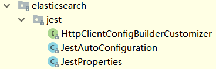

# springboot-elasticsearch-jest

Jest是一个Elasticsearch的Java Rest API库

> 更多介绍可以参考：[Jest github](https://github.com/searchbox-io/Jest)


## Maven配置

```xml
<dependency>
	<groupId>io.searchbox</groupId>
	<artifactId>jest</artifactId>
	<version>x.x.x</version>
</dependency>

<!-- 引入Elasticsearch依赖，可以使用QueryBuilder、Settings等 -->
<dependency>
	<groupId>org.elasticsearch</groupId>
	<artifactId>elasticsearch</artifactId>
	<version>5.5.1</version>
</dependency>
```

在做一些ES的crud操作时，为了便于构造对于的ES json source，故引入了Elasticsearch依赖


**Jest与ES版本兼容性**

| Jest Version  | Elasticsearch Version |
| :-----------: | :-------------------: |
|   >= 6.0.0    |           6           |
|   >= 5.0.0    |           5           |
|   >= 2.0.0    |           2           |
| 0.1.0 - 1.0.0 |           1           |
|   <= 0.0.6    |          < 1          |

由于我的ES版本是5.5.1，故选择Jest 5.3.4

<br>

## SpringBoot Jest配置

### YML配置

此项目支持的所有配置如下：

```yaml
spring:
  elasticsearch:
    jest:
      uris: ["http://172.18.101.128:9200", "http://172.18.101.129:9200", "http://172.18.101.131:9200"]
      connection-timeout: 10000   #连接超时，单位毫秒
      read-timeout: 60000         #读超时，单位毫秒
      multi-threaded: true        #是否启用连接池
      maxTotalConnection: 20      #最大连接数，默认值：30
      defaultMaxTotalConnectionPerRoute: 10   #默认每个路由的最大连接数，默认值：10
      maxConnectionIdleTimeInSecond: 600      #连接空闲多少秒会被认定为空闲连接并关闭，默认值：0，不开启空闲连接检测
      discoveryEnabled: true           #是否启用自动发现ES Node，默认值：false
      discoveryFrequencyInSecond: 10   #自动发现的频率，单位秒，默认60s
```

其中部分配置是springboot配置类支持的，部分是通过实现HttpClientConfigBuilderCustomizer，并@Value读取的

绝大多数配置都有默认值，最小配置如下：

```yaml
spring:
  elasticsearch:
    jest:
      uris: ["http://localhost:9200"]
```


### SpringBoot对Jest的支持

此项目使用的SpringBoot版本是 1.5.16.RELEASE，SpringBoot默认支持的Elasticsearch Java Rest API就是Jest，这也是之所以选择Jest的原因

springboot对Jest的支持在spring-boot-autoconfigure-1.5.16.RELEASE.jar中，org.springframework.boot.autoconfigure.elasticsearch.jest包下，包括：




#### JestProperties（Jest配置类）

```java
@ConfigurationProperties(prefix = "spring.elasticsearch.jest")
public class JestProperties {

	/**
	 * Comma-separated list of the Elasticsearch instances to use.
	 */
	private List<String> uris = new ArrayList<String>(
			Collections.singletonList("http://localhost:9200"));

	/**
	 * Login user.
	 */
	private String username;

	/**
	 * Login password.
	 */
	private String password;

	/**
	 * Enable connection requests from multiple execution threads.
	 */
	private boolean multiThreaded = true;

	/**
	 * Connection timeout in milliseconds.
	 */
	private int connectionTimeout = 3000;

	/**
	 * Read timeout in milliseconds.
	 */
	private int readTimeout = 3000;

	/**
	 * Proxy settings.
	 */
	private final Proxy proxy = new Proxy();

	......

	public static class Proxy {

		/**
		 * Proxy host the HTTP client should use.
		 */
		private String host;

		/**
		 * Proxy port the HTTP client should use.
		 */
		private Integer port;

	}

}
```

@ConfigurationProperties(prefix = "spring.elasticsearch.jest")表示配置类会读取以spring.elasticsearch.jest为前缀的属性，例如

- uris：以逗号分隔的Elasticsearch实例列表（9200端口）
- username、password：如果访问ES开启了基于用户名、密码的认证，需要配置
- multiThreaded：boolean值，访问ES时是否使用连接池
- connectionTimeout：http连接超时时间
- readTimeout：http读超时时间
- proxy：代理相关配置

以上配置是可以直接写在application.yml中的，由于Jest底层使用的是**apache httpclient**，以上的配置都是在做httpclient相关配置


#### HttpClientConfigBuilderCustomizer（HttpClientConfigBuilder定制器）

HttpClientConfig的定制器接口，在Jest自动配置时会依次调用所有此接口的实现类，`customize(builder)`方法会获取到HttpClientConfig.Builder，用以添加自定义的HttpClientConfig配置

```java
/**
 * Callback interface that can be implemented by beans wishing to further customize the
 * {@link HttpClientConfig} via a {@link Builder HttpClientConfig.Builder} whilst
 * retaining default auto-configuration.
 *
 * @author Stephane Nicoll
 * @since 1.5.0
 */
public interface HttpClientConfigBuilderCustomizer {

	/**
	 * Customize the {@link Builder}.
	 * @param builder the builder to customize
	 */
	void customize(Builder builder);

}
```

如果JestProperties中的配置项不够，还需要定制底层创建的httpclient，可以考虑使用HttpClientConfigBuilderCustomizer，只需要编写实现类，并将实现类注册到Spring容器中

此项目中定制了以下配置：

- maxTotalConnection：httpclient连接池最大连接数
- defaultMaxTotalConnectionPerRoute：httpclient连接池默认每个路由的最大连接数
- maxConnectionIdleTimeInSecond：连接空闲多少秒会被认定为空闲连接并关闭
- discoveryEnabled：是否启用自动发现ES Node
- discoveryFrequencyInSecond：自动发现的频率，单位秒

具体实现请见：[JestHttpClientConfigBuilderCustomizer](https://github.com/trust-freedom/springboot-learning-example/blob/master/spring-boot-elasticsearch-jest/src/main/java/com/freedom/springboot/elasticsearch/jest/config/JestHttpClientConfigBuilderCustomizer.java)


#### JestAutoConfiguration（Jest自动配置类）

```java
@Configuration  //配置类
@ConditionalOnClass(JestClient.class)  //类路径下需要JestClient类
@EnableConfigurationProperties(JestProperties.class)  //激活JestProperties配置类
@AutoConfigureAfter(GsonAutoConfiguration.class)  //在GsonAutoConfiguration之后配置
public class JestAutoConfiguration {

	private final JestProperties properties;

	private final ObjectProvider<Gson> gsonProvider;

	private final List<HttpClientConfigBuilderCustomizer> builderCustomizers;

    /**
     * 有参构造的参数：JestProperties、Gson、List<HttpClientConfigBuilderCustomizer>会从spring容器中获取
     */
	public JestAutoConfiguration(JestProperties properties, ObjectProvider<Gson> gson,
			ObjectProvider<List<HttpClientConfigBuilderCustomizer>> builderCustomizers) {
		this.properties = properties;
		this.gsonProvider = gson;
		this.builderCustomizers = builderCustomizers.getIfAvailable();
	}

    /**
     * 向spring容器中注册JestClient
     */
	@Bean(destroyMethod = "shutdownClient")
	@ConditionalOnMissingBean
	public JestClient jestClient() {
		JestClientFactory factory = new JestClientFactory();
		factory.setHttpClientConfig(createHttpClientConfig());
		return factory.getObject();
	}

    /**
     * 根据JestProperties的配置创建HttpClientConfig配置
     * 并在最后调用customize(builder)方法，其中会循环调用所有HttpClientConfigBuilderCustomizer的实现类
     */
	protected HttpClientConfig createHttpClientConfig() {
		HttpClientConfig.Builder builder = new HttpClientConfig.Builder(
				this.properties.getUris());
		if (StringUtils.hasText(this.properties.getUsername())) {
			builder.defaultCredentials(this.properties.getUsername(),
					this.properties.getPassword());
		}
		String proxyHost = this.properties.getProxy().getHost();
		if (StringUtils.hasText(proxyHost)) {
			Integer proxyPort = this.properties.getProxy().getPort();
			Assert.notNull(proxyPort, "Proxy port must not be null");
			builder.proxy(new HttpHost(proxyHost, proxyPort));
		}
		Gson gson = this.gsonProvider.getIfUnique();
		if (gson != null) {
			builder.gson(gson);
		}
		builder.multiThreaded(this.properties.isMultiThreaded());
		builder.connTimeout(this.properties.getConnectionTimeout())
				.readTimeout(this.properties.getReadTimeout());
		customize(builder);
		return builder.build();
	}

    /**
     * 循环调用所有HttpClientConfigBuilderCustomizer的实现类customize(builder)方法
     * 这些实现类会通过传入的HttpClientConfig.Builder对HttpClientConfig增加自定义配置
     */
	private void customize(HttpClientConfig.Builder builder) {
		if (this.builderCustomizers != null) {
			for (HttpClientConfigBuilderCustomizer customizer : this.builderCustomizers) {
				customizer.customize(builder);
			}
		}
	}
}
```

从上面的`JestAutoConfiguration`自动配置类源码可知，如果要启用SpringBoot对Jest的支持，开启这个自动配置类，只需要在classpath下引入Jest的依赖，这样@ConditionalOnClass(JestClient.class)条件就会成立

从`createHttpClientConfig()`方法最后调用的`customize(builder)`可以看出，自动配置给自定义留了口，`customize(builder)`中会循环调用spring容器中的HttpClientConfigBuilderCustomizer实现类，通过传入的HttpClientConfig.Builder达到对HttpClientConfig添加自定义配置的目的

HttpClientConfig是用来创建`JestClientFactory`时用的，而`JestClientFactory`是创建`JestClient`的工厂，`JestClient`是调用Jest API的入口，拥有CloseableHttpClient 和 CloseableHttpAsyncClient的成员变量，来实现http同步或异步调用。故具体创建`JestClient`的逻辑还是要参考 [JestClientFactory的源码](https://github.com/searchbox-io/Jest/blob/v5.3.4/jest/src/main/java/io/searchbox/client/JestClientFactory.java)

<br>

## JestClient使用

在完成了 **Maven配置** 及 **YML配置** 后，就可以@Autowired自动注入JestClient，通过JestClient做Elasticsearch的crud操作，具体用法请见测试用例：[JestTests](https://github.com/trust-freedom/springboot-learning-example/blob/master/spring-boot-elasticsearch-jest/src/test/java/com/freedom/springboot/elasticsearch/jest/JestTests.java)

> 也可以参考Jest官方文档：https://github.com/searchbox-io/Jest/tree/master/jest


